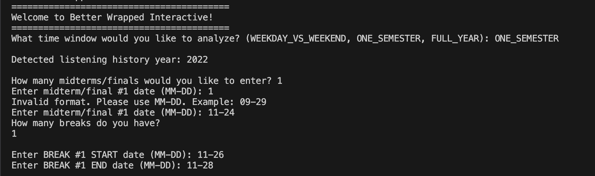

# CS62 Final Project
Better Wrapped is a more personalized and context-aware experience that not only summarizes music listening history but why and when they listened. It is especially tailored to students by looking at semester and year schedules. Write-up with interview notes and project motivations are [here](https://docs.google.com/document/d/11LSb0u0Y-2pWvhK-tQDKIbNrH4US5A39U8TY9_U_cIk/edit?tab=t.0).

## Project Intro: What even is Better Wrapped?
At the end of every year, Spotify releases “Spotify Wrapped,” a slideshow that summarizes users’ listening habits over the past year. It compiles data on each users’ favorite artists, songs, and total minutes listened, and presents the information in a way that makes it easy for users to share their music summaries with each other. However, this music summary is static. It does not provide any insight into the ways a user’s listening habits change throughout time periods. We believe that music listening data is closely connected to one’s daily routines, emotional states, and life events. Thus, we built Better Wrapped, a more personalized and context-aware experience that not only summarizes listening history but also allows users to understand the differences between their music tastes during various academic time windows.

Specifically, Better Wrapped introduces three key features. First, it maps listening trends to important academic events: weekends vs weekdays, midterms vs academic breaks vs normal days in a semester, or differences in fall and spring semester and summer break. Second, our program detects outliers in students’ listening habits that don’t fit with their normal listening taste during the time window. Third, based on a users’ top genre in a time period, Better Wrapped provides song recommendations that the user might also enjoy listening to. With this project, we hope that Better Wrapped will show students how their academic lives contextualize their listening habits.

### Data Structures
We will be implementing a list of key-value pairs, with the timestamp of each song being the key. Additionally, we will create a SongInfo object to contain information about each song, and the SongInfo object associated with each timestamp will be the value in the key-value pair.
We will also be mapping from bucket (e.g. midterm, break, spring semester, etc) to a list of songs played in that bucket, for Feature 2.

### The Data Set
We use data from [last.fm](http://last.fm). [This dataset](https://www.kaggle.com/datasets/basharsalman/lastfm) has timestamps as well as the artist, song name, and genre of each song. We will use [this dataset](https://www.kaggle.com/datasets/jacopoferretti/chinook-music-database?select=archive), which includes lots of different songs, for Feature 3.

---

## Feature Highlights

### Feature 1: Listening Trend Analysis
Look at how users’ listening behavior changes across different academic time periods. It will do so by analyzing song genres, artists, and top songs over a specified time window.
* **Example Output:** Compares your Top Artist during "Midterms" (e.g., Radiohead) vs. your Top Artist during "Summer Break" (e.g., Anathema).

### Feature 2: Detecting Outliers
Find days where a student’s listening behavior is different from their normal listening habits (by the genre they listen to the most) in the established time period.
* **Example Output:** Flags a specific date, such as `2017-12-22`, where a student listened to an unusual amount of "Metal" despite "Rock" being their seasonal norm.

### Feature 3: Focused Recommendations
Give the user song recommendations based on the student’s listening habits during the time window chosen. We recommend songs that match the student's most popular genre for that specific context.
* **Example Output:** If your top genre during Fall was "Grunge," the system will output 15 Grunge tracks you haven't listened to yet.

---

## Execution Instructions
The central component of this software is the **`BetterWrapped.java`** file. All project features and logic are executed from this file's `public static void main` method.

1. **Run the Main File:** Open and run `BetterWrapped.java`.
2. **Select Analysis Window:** The console will ask which time window you would like to analyze: `WEEKDAY_VS_WEEKEND`, `ONE_SEMESTER`, or `FULL_YEAR`.
3. **Configuration:** - If you choose **ONE_SEMESTER**, you will be prompted to input the number of midterms and breaks.
   - You will then be asked to input the start and end dates for those periods.
4. **View Your Wrapped:** The program will process your CSV and display the statistics, detected outliers, and recommendations directly in the console.

## Public API Reference
The following public methods represent the primary interface for the `BetterWrapped` class.

### `public BetterWrapped(String fileName)`
* **Description:** Constructor that initializes the `allHistory` list by parsing the provided CSV listening history.
* **Input:** `String` (The file path to the listening history CSV).
* **Output:** A `BetterWrapped` object with a populated history list.

### `public void analyze(String type, List<Timestamp> midterms, List<Timestamp> breaks, ...)`
* **Description:** Executes **Feature 1** (Trend Analysis). It filters songs into specific academic "buckets" and calculates top frequencies.
* **Inputs:** `String` for the window type and `Lists` of `Timestamp` objects defining the academic windows.
* **Output:** Prints detailed `SongStatistics` to the console.

### `public void detectOutliersBySemester(List<Timestamp> midterms, List<Timestamp> breaks)`
* **Description:** Executes **Feature 2** (Outlier Detection). It identifies days where the primary genre listened to differs significantly from the seasonal average.
* **Inputs:** `List<Timestamp>` objects for midterm and break boundaries.
* **Output:** Prints dates where listening behavior deviated from the norm.

### `public void recommendBySemester(List<Timestamp> midterms, List<Timestamp> breaks, String recommendationFile)`
* **Description:** Executes **Feature 3** (Focused Recommendations). It analyzes the top genre of a specific period and suggests 15 songs from a separate recommendation database.
* **Inputs:** Academic window `Timestamps` and the path to the recommendation CSV file.
* **Output:** Prints 15 recommended songs for that time window.

## Results Preview
Below are the results of the `BetterWrapped.java` execution:

  
*The user is prompted to select their analysis window.*

  
*The final output showing seasonal statistics, outliers, and recommendations.*
