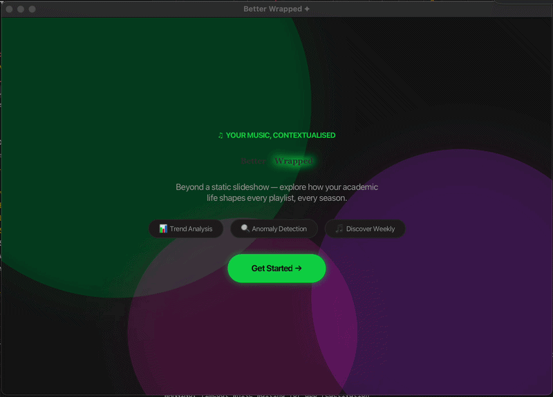

# Better Wrapped

*Authors: Neha Dixit, Olivia Ma, Stefanie Nguyen*

Better Wrapped is a more personalized and context-aware experience that not only summarizes music listening history but why and when they listened. It is especially tailored to students by looking at semester and year schedules. The full write-up with project motivation, analysis, and reflection can be found [here](https://docs.google.com/document/d/101-mJg4NkhzfgP9eDJ299lXNP9pA6s6ord0t_SuiXIs/edit?usp=sharing).

## Table of Contents
- [Project Intro](#project-intro-what-even-is-better-wrapped)
- [How to Run the Code](#how-to-run-the-code)
- [Project Structure](#project-structure)
- [Feature Highlights](#feature-highlights)
- [Execution Instructions](#execution-instructions)
- [Graphical User Interface (GUI)](#graphical-user-interface)
- [Public API Reference](#public-api-reference)

## Project Intro: What even is Better Wrapped?
At the end of every year, Spotify releases “Spotify Wrapped,” a slideshow that summarizes users’ listening habits over the past year. It compiles data on each users’ favorite artists, songs, and total minutes listened, and presents the information in a way that makes it easy for users to share their music summaries with each other. However, this music summary is static. It does not provide any insight into the ways a user’s listening habits change throughout time periods. We believe that music listening data is closely connected to one’s daily routines, emotional states, and life events. Thus, we built Better Wrapped, a more personalized and context-aware experience that not only summarizes listening history but also allows users to understand the differences between their music tastes during various academic time windows.

Specifically, Better Wrapped introduces three key features. First, it maps listening trends to important academic events: weekends vs weekdays, midterms vs academic breaks vs normal days in a semester, or differences in fall and spring semester and summer break. Second, our program detects outliers in students’ listening habits that don’t fit with their normal listening taste during the time window. Third, based on a users’ top genre in a time period, Better Wrapped provides song recommendations that the user might also enjoy listening to. With this project, we hope that Better Wrapped will show students how their academic lives contextualize their listening habits.

### Example Output

```
Note: For FULL_YEAR analysis, we consider January-April to be Spring Semester, May-August to be Summer Break, and September-December to be Fall Semester.
Please ensure your listening history is from January to December of the same year (e.g., not from September of one year to September of another).

Generating your Better Wrapped...
=== SPRING STATS ===
Top Artist: Radiohead
Top Song: Jigsaw Falling Into Place
Top Genre: Rock

=== SUMMER STATS ===
Top Artist: Anathema
Top Song: Springfield
Top Genre: Rock

=== FALL STATS ===
Top Artist: Audioslave
Top Song: Getaway Car
Top Genre: Rock

=== Listening Trend Comparison ===

>> SPRING vs SUMMER
Your top genre stayed consistent. Your top genre was: Rock
Favorite artist changed from Radiohead during SPRING to Anathema during SUMMER
Top song changed from Jigsaw Falling Into Place during SPRING to Springfield during SUMMER
---------

>> SPRING vs FALL
Your top genre stayed consistent. Your top genre was: Rock
Favorite artist changed from Radiohead during SPRING to Audioslave during FALL
Top song changed from Jigsaw Falling Into Place during SPRING to Getaway Car during FALL
---------

>> SUMMER vs FALL
Your top genre stayed consistent. Your top genre was: Rock
Favorite artist changed from Anathema during SUMMER to Audioslave during FALL
Top song changed from Springfield during SUMMER to Getaway Car during FALL
---------
```
*Console output of *Feature 1*: statistics and side-by-side listening trend comparison between spring, summer, and fall semesters.*

### Data Structures
We will be using a list of key-value pairs (`List<KeyValuePair>`) as the primary structure, with the `Timestamp` of each song being the key and the `SongInfo` object associated being the value, which contains information about each song. 

For features 1 and 2, we additionally map listening history into `Bucket` objects, where each bucket is named (e.g. `"MIDTERM"`, `"BREAK"`) and stores the list of plays that fall into it. For feature 3, we use a `Map<String, List<RecommendationSong>>` from bucket name to recommended songs.

### The Data Set
We use scrobble data from [last.fm](http://last.fm). [This dataset from Kaggle](https://www.kaggle.com/datasets/basharsalman/lastfm), stored as `lastFMScrobblesDataSet.csv`, has timestamps as well as the artist, song name, and genre of each song. We will use [Chinook music database](https://www.kaggle.com/datasets/zaheenhamidani/ultimate-spotify-tracks-db), stored as `MasterListofSongs(Feature3).csv`, which includes lots of different songs, to recommend songs for Feature 3. *None of the datasets have sensitive information.*

## How to Run the Code

- To run the console version, execute `BetterWrapped.java`. See the [Execution Instructions](#execution-instructions) section for details.
- To run the JavaFX GUI version, execute `BetterWrappedGUILauncher.java` (macOS only). See the [GUI](#graphical-user-interface) section for details.

*The program assumes that the CSV with the user's listening history is nicely inputted and correctly formatted as shown by our existing CSV files. Users can create an alternate CSV of the same format and place it in `BetterWrappedProject` to run the program.*

## Project Structure
```
csci062finalproject/
├── README.md
├── lib/                                    # included .jar files for GUI launcher
├── images/                                 # example/demo used in README
└── src/BetterWrappedProject/
   ├── BetterWrapped.java                   # entry point + use the program
   ├── BetterWrappedTesting.java            # test driver
   ├── BetterWrappedGUI.java                # JavaFX frontend
   ├── BetterWrappedGUILauncher.java        # JavaFX launcher
   ├── style.css                            # style sheet of the GUI
   ├── KeyValuePair.java                    # (Timestamp, SongInfo) pair - core data structure element
   ├── SongInfo.java                        # metadata (artist, name, genre) for a given song
   ├── Bucket.java                          # named group of plays for a time period
   ├── SongStatistics.java                  # computes top artist/song/genre from a list of plays
   ├── OutlierDetector.java                 # Feature 2 - finds days whose top genre differs from the bucket norm
   ├── OutlierDay.java                      # a flagged outlier day
   ├── RecommendationEngine.java            # Feature 3 - recommends new songs from a master list
   ├── RecommendationLoader.java            # loads all the recommendation songs from the CSV
   ├── RecommendationSong.java              # a song that can be recommended to a user
   ├── MusicDataLoader.java                 # loads music listening history from a CSV
   ├── testScrobbles.csv                    # test dataset
   ├── testSongs(Feature3).csv              # small recommendation test pool
   ├── MasterListofSongs(Feature3).csv      # recommendation candidate pool
   ├── ScrobblesForOneWeek.csv              # bundled dataset for one week
   ├── ScrobblesForOneSemester.csv          # bundled dataset for one semester
   ├── ScrobblesForOneYear.csv              # bundled dataset for one year
   ├── ScrobblesForOneYear.csv              # bundled dataset for the spring semester
   └── lastFMScrobblesDataSet.csv           # full last.fm dataset
```

## Feature Highlights

### Feature 1: Listening Trend Analysis
Look at how users’ listening behavior changes across different academic time periods. It will do so by analyzing song genres, artists, and top songs over a specified time window. Users can see analysis through three ways:
- `WEEKDAY_VS_WEEKEND`: splits plays by day of the week (Monday, Tuesday, etc)
- `ONE_SEMESTER`: splits plays into `MIDTERM` (5-day window before each midterm/final date), `BREAK` (within any break window), and `NORMAL`. Breaks takes priority over midterms when they overlap.
- `FULL_YEAR`:splits plays into `SPRING`, `SUMMER`, and `FALL`.

It first prints per-bucket statistics, then does side-by-side comparisons describing how genre/artist/song changes between each pair of buckets.

### Feature 2: Detecting Outliers
For each bucket from Feature 1, find days where a student’s listening behavior is different from their normal listening habits (by the genre they listen to the most). A day must have at least `MIN_PLAYS_PER_DAY = 4` to be flagged to avoid single-day "outliers." For each bucket, the results are sorted by play count descending and capped at the top 5 outliers per bucket.

```
=== Outlier Days ===

--- FALL ---
  - 2017-12-22: played Metal 108 times, but usually Rock during FALL
  - 2017-11-21: played Punk 96 times, but usually Rock during FALL
  - 2017-12-17: played Progressive Metal 94 times, but usually Rock during FALL
  - 2017-11-06: played Alternative 75 times, but usually Rock during FALL
  - 2017-10-24: played Pop 69 times, but usually Rock during FALL

--- SPRING ---
  - 2017-02-07: played Metal 107 times, but usually Rock during SPRING
  - 2017-01-18: played Alternative 91 times, but usually Rock during SPRING
  - 2017-02-05: played Classical 89 times, but usually Rock during SPRING
  - 2017-01-28: played Jazz 78 times, but usually Rock during SPRING
  - 2017-01-21: played Metal 72 times, but usually Rock during SPRING

--- SUMMER ---
  - 2017-06-17: played Jazz 118 times, but usually Rock during SUMMER
  - 2017-06-16: played Jazz 100 times, but usually Rock during SUMMER
  - 2017-07-22: played Blues 94 times, but usually Rock during SUMMER
  - 2017-06-05: played Jazz 90 times, but usually Rock during SUMMER
  - 2017-06-27: played Classical 88 times, but usually Rock during SUMMER
```
*Feature 2 example output: flagging a specific date, such as `2017-12-22`, where a student listened to an unusual amount of "Metal" despite "Rock" being their seasonal norm.*

### Feature 3: Focused Recommendations
Give the user song recommendations based on the student’s listening habits during the time window chosen. We recommend up to 15 songs that match the student's most popular genre for that specific context. 

```
=== Song Recommendations ===
>> SPRING (Based on your top genre):
  - Black Sun by Death Cab for Cutie (Rock)
  - On My Side by Demon Hunter (Rock)
  - Bitter With The Sweet by Carole King (Rock)
  - Worn by Tenth Avenue North (Rock)
  - House Party by Sublime With Rome (Rock)
  - Already Gold by Iration (Rock)
  - The Mighty Fall by Fall Out Boy (Rock)
  - Wake Me Up by Foreign Air (Rock)
  - One More Day by Diamond Rio (Rock)
  - (You Make Me Feel Like) A Natural Woman by Carole King (Rock)
  - Dead Inside by Muse (Rock)
  - (Oh) Pretty Woman - 2015 Remaster by Van Halen (Rock)
  - I Get the Picture by Mitchell Tenpenny (Rock)
  - Hot Thoughts by Spoon (Rock)
  - Rocket Queen by Guns N' Roses (Rock)

>> SUMMER (Based on your top genre):
  - Give Me Your Eyes by Brandon Heath (Rock)
  - Stop! In The Name Of Love by The Supremes (Rock)
  - Tú Sí Sabes Quererme (feat. Los Macorinos) by Natalia Lafourcade (Rock)
  - How Much I Feel (45 Version) by Ambrosia (Rock)
  - Fairytale of New York (feat. Kirsty MacColl) by The Pogues (Rock)
  - With Me All Along by Bronze Radio Return (Rock)
  - Hum Hallelujah by Fall Out Boy (Rock)
  - How Many More Times - 1993 Remaster by Led Zeppelin (Rock)
  - China Girl - 1999 Remastered Version by David Bowie (Rock)
  - On The Line by Night Riots (Rock)
  - New Speedway Boogie by Grateful Dead (Rock)
  - Cry Little Sister by Marilyn Manson (Rock)
  - Plans by Oh Wonder (Rock)
  - Low by Cracker (Rock)
  - Then Came the Last Days of May by Blue Öyster Cult (Rock)

>> FALL (Based on your top genre):
  - Say Say Say - Remastered 2015 by Paul McCartney (Rock)
  - Spill The Wine by Eric Burdon (Rock)
  - Pitchfork Kids by AJR (Rock)
  - Empire (Let Them Sing) by Bring Me The Horizon (Rock)
  - King Of Pain - Remastered 2003 by The Police (Rock)
  - Box # 10 by Jim Croce (Rock)
  - All Over by CRUISR (Rock)
  - Devils Haircut by Beck (Rock)
  - Stay Downtown by Cole Swindell (Rock)
  - Machine Gun - Live at the Fillmore East by Jimi Hendrix (Rock)
  - 63 Days by Atlas Genius (Rock)
  - Andar Conmigo by Julieta Venegas (Rock)
  - Never Been To Spain by Three Dog Night (Rock)
  - "Down in New Orleans - From ""The Princess and the Frog""/Soundtrack Version" by Dr. John (Rock)
  - In This Love by Stick Figure (Rock)
```
*Feature 3 example output: if your top genre during Fall was "Rock," the system will output 15 Rock tracks you haven't listened to yet.*

## Execution Instructions
The central component of this software is the **`BetterWrapped.java`** file. All project features and logic are executed from this file's `public static void main` method.

1. **Run the Main File:** Open and run `BetterWrapped.java`.
2. **Select Analysis Window:** The console will ask which time window you would like to analyze: `WEEKDAY_VS_WEEKEND`, `ONE_SEMESTER`, or `FULL_YEAR`.
3. **Configuration:** - If you choose **ONE_SEMESTER**, you will be prompted to input the number of midterms and breaks.
   - If you chooose `ONE_SEMESTER`, you will be prompted to input the number of midterms and break, and then asked to input the start and end dates for those periods.
   - If you chooose `WEEKDAY_VS_WEEKEND` or `FULL_YEAR`, you will not be prompted to input anything since the system presets dates for those windows.
     - For the `FULL_YEAR` analysis, we consider January-April to be Spring Semester, May-August to be Summer Break, and September-December to be Fall Semester.
     - `FULL_YEAR` is defined to be from January to December *only*, so the program would not do full year with overlap (i.e. September 2022 to September 2023).

```
=========================================
Welcome to Better Wrapped Interactive!
=========================================
What time window would you like to analyze? (WEEKDAY_VS_WEEKEND, ONE_SEMESTER, FULL_YEAR): ONE_SEMESTER

Detected listening history year: 2022

How many midterms/finals would you like to enter? 1
Enter midterm/final #1 date (MM-DD): 1
Invalid format. Please use MM-DD. Example: 09-29 
Enter midterm/final #1 date (MM-DD): 03-30
How many breaks do you have? 
1

Enter BREAK #1 START date (MM-DD): 04-20
Enter BREAK #1 END date (MM-DD): 04-22
``` 
*The user is prompted to select their analysis window.*

4. **View Your Wrapped:** The program will process your CSV and display the statistics, detected outliers, and recommendations directly in the console.

## Graphical User Interface

For a more visual and interactive experience, this project includes a Graphical User Interface built with **JavaFX**. Since this is out of the scope of the class, we used LLMs to assist us in building the GUI. The full conversation transcript detailing this assistance can be found here: 
[Claude AI Conversation Transcript](https://claude.ai/share/60df2777-4181-44d5-8081-8332fc97ae03).

To launch the GUI, simply run the **`BetterWrappedGUILauncher.java`** file. 

Because JavaFX is not a built-in library, we will need to configure the SDK for your system before running the GUI:

1. Go to the [Gluon JavaFX](https://gluonhq.com/products/javafx/) download page and download the **JavaFX 21 SDK** for your specific OS (Windows, Mac, or Linux).
2. Unzip the downloaded file, and drag the complete `lib/` folder from that download directly into your `csci062finalproject` folder.
3. In VS Code, go to the **Java Projects** tab (bottom left), expand **Referenced Libraries**, click the **+** icon, and highlight all the `.jar` files in your newly downloaded `lib` folder.
4. Hit run on **`BetterWrappedGUILauncher.java`**!

Here's the demo of the GUI:

  

## Public API Reference
This section documents every public method on every class, with a usage example for each. Constructors come first within each class.

### `BetterWrapped`

#### `public BetterWrapped(String fileName)`
- **Description:** Constructor that initializes the `allHistory` list by parsing the provided CSV listening history.
- **Input:** `fileName`, the file path to the listening history CSV.
- **Output:** A new `BetterWrapped` object with `allHistory` populated.
- **Usage example:**
  ```java
  BetterWrapped wrapped = new BetterWrapped("src/BetterWrappedProject/ScrobblesForOneWeek.csv");
  // wrapped.getAllHistory() now contains plays in ScrobblesForOneWeek.csv
  ```
  
#### `public void analyze(String comparisonType, List<Timestamp> midtermDates, List<Timestamp> breakDates, List<Timestamp> springDates, List<Timestamp> summerDates, List<Timestamp> fallDates)`
- **Description:** Executes **Feature 1** (Trend Analysis). It filters songs into specific academic "buckets" and calculates top frequencies.
- **Inputs:**
  - `comparisonType`, the window type: one of `"WEEKDAY_VS_WEEKEND"`, `"ONE_SEMESTER"`, or `"FULL_YEAR"`.
  - `midtermDates`, list of midterm deadline timestamps (used only by `ONE_SEMESTER`).
  - `breakDates`, pairs of timestamps bounding each break window (used only by `ONE_SEMESTER`).
  - `springDates`, `summerDates`, `fallDates`: pairs of `[start, end]` bounding each semester (used only by `FULL_YEAR`).
- **Output:** None (prints detailed `SongStatistics` to the console).
- **Usage example:**
  ```java
  wrapped.analyze("WEEKDAY_VS_WEEKEND", null, null, null, null, null);
  // print in the console:
  // === WEEKDAY STATS ===
  // Top Artist: Dua Lipa
  // Top Song: Levitating
  // Top Genre: Pop
  // === WEEKEND STATS ===
  // Top Artist: Dua Lipa
  // ...
  ```

#### `public void detectOutliersByWeekdayWeekend()`
- **Description:** Executes **Feature 2** for the weekday and weekend buckets.
- **Inputs:** None
- **Output:** None (prints outlier days to the console).
- **Usage example:**
  ```java
  wrapped.detectOutliersByWeekdayWeekend();
  // print in the console:
  // === Outlier Days ===
  // --- WEEKDAY ---
  //   - 2023-10-04: played Classical 6 times, but usually Pop during WEEKDAY
  ```

#### `public void detectOutliersBySemester(List<Timestamp> midterms, List<Timestamp> breaks)`
- **Description:** Executes **Feature 2** for midterm, break, and normal buckets.
- **Inputs:** `List<Timestamp>` objects for midterm and break boundaries.
- **Output:** None (prints outlier days to the console).
  ```java
  List<Timestamp> midterms = new ArrayList<>();
  midterms.add(Timestamp.valueOf(LocalDateTime.of(2023, 9, 29, 23, 59)));
  List<Timestamp> breaks = new ArrayList<>();
  breaks.add(Timestamp.valueOf(LocalDateTime.of(2023, 11, 20, 0, 0)));
  breaks.add(Timestamp.valueOf(LocalDateTime.of(2023, 11, 26, 23, 59)));

  wrapped.detectOutliersBySemester(midterms, breaks);
  // print in the console:
  // --- NORMAL ---
  //   - 2017-12-22: played Metal 12 times, but usually Rock during NORMAL
  ```

#### `public void detectOutliersByYear(List<Timestamp> springDates, List<Timestamp> summerDates, List<Timestamp> fallDates)`
- **Description:** Executes **Feature 2** for spring, summer, and fall buckets.
- **Inputs:** `List<Timestamp>` objects for spring, summer, and fall boundaries.
- **Output:** None (prints outlier days to the console).
  ```java
  List<Timestamp> spring = List.of(
      Timestamp.valueOf(LocalDateTime.of(2023, 1, 1, 0, 0)),
      Timestamp.valueOf(LocalDateTime.of(2023, 4, 30, 23, 59)));
  List<Timestamp> summer = List.of(
      Timestamp.valueOf(LocalDateTime.of(2023, 5, 1, 0, 0)),
      Timestamp.valueOf(LocalDateTime.of(2023, 8, 31, 23, 59)));
  List<Timestamp> fall = List.of(
      Timestamp.valueOf(LocalDateTime.of(2023, 9, 1, 0, 0)),
      Timestamp.valueOf(LocalDateTime.of(2023, 12, 31, 23, 59)));

  wrapped.detectOutliersByYear(spring, summer, fall);
  // print in the console:
  // --- FALL ---
  //   - 2023-11-15: played Jazz 7 times, but usually Rock during FALL
  ```

#### `public void recommendByWeekdayWeekend(String recommendationFile)`
- **Description:** Executes **Feature 3** for weekday and weekend buckets.
- **Input:** `recommendationFile`, path to a CSV.
- **Output:** none (prints recommendations to console).
- **Usage example:**
  ```java
  wrapped.recommendByWeekdayWeekend("src/BetterWrappedProject/MasterListofSongs(Feature3).csv");
  // print in the console:
  // === Song Recommendations ===
  // >> WEEKDAY (Based on your top genre):
  //   - Don't Stop Me Now by Queen (Pop)
  //   - Shape of You by Ed Sheeran (Pop)
  //   ...
  ```

#### `public void recommendBySemester(List<Timestamp> midtermDates, List<Timestamp> breakDates, String recommendationFile)`
- **Description:** Executes **Feature 3** for midterm, break, and normal buckets.
- **Inputs:** Academic window `Timestamps` and the path to the recommendation CSV file.
- **Output:** None (prints 15 recommended songs for that time window).
- **Usage example:**
  ```java
  wrapped.recommendBySemester(midterms, breaks,
      "src/BetterWrappedProject/MasterListofSongs(Feature3).csv");
  // print in the console:
  // >> MIDTERM (Based on your top genre):
  //   - Clair de Lune by Debussy (Classical)
  //   ...
  ```
#### `public void recommendByYear(List<Timestamp> springDates, List<Timestamp> summerDates, List<Timestamp> fallDates, String recommendationFile)`
- **Description:** Executes **Feature 3** for spring, summer, and fall buckets.
- **Inputs:** Semester window `Timestamps` and the path to the recommendation CSV file.
- **Output:** None (prints 15 recommended songs for that time window).
- **Usage example:**
  ```java
  wrapped.recommendByYear(spring, summer, fall, "src/BetterWrappedProject/MasterListofSongs(Feature3).csv");
  // print in the console:
  // >> FALL (Based on your top genre):
  //   - Smells Like Teen Spirit by Nirvana (Grunge)
  //   - Black Hole Sun by Soundgarden (Grunge)
  //   ...
  ```

### `KeyValuePair`

#### `public KeyValuePair(Timestamp timeStamp, SongInfo songObject)`
- **Description:** Constructor that builds a single play event.
- **Inputs:** `Timestamp` of the play, `SongInfo` describing the song.
- **Output:** A new `KeyValuePair`.
- **Usage example:**
  ```java
  SongInfo song = new SongInfo("The Weeknd", "Blinding Lights", "Pop");
  Timestamp ts = Timestamp.valueOf("2026-05-08 12:30:00");
  KeyValuePair pair = new KeyValuePair(ts, song);
  ```

#### `public Timestamp getTimeStamp()`
- **Description:** Returns the time the song was played.
- **Usage example:**
  ```java
  System.out.println(pair.getTimeStamp());
  // Output: 2026-05-08 12:30:00.0
  ```

#### `public void setTimeStamp(Timestamp newTimeStamp)`
- **Description:** Updates the timestamp of this play event.
- **Input:** new timestamp of this play.
- **Usage example:**
  ```java
  pair.setTimeStamp(Timestamp.valueOf("2026-05-09 09:00:00"));
  // pair.getTimeStamp() now returns 2026-05-09 09:00:00.0
  ```

#### `public SongInfo getSongObject()`
- **Description:** Returns the `SongInfo` associated with this play event.
- **Usage example:**
  ```java
  System.out.println(pair.getSongObject().getName());
  // Output: Blinding Lights
  ```

#### `public void setSongObject(SongInfo song)`
- **Description:** Replaces the `SongInfo` associated with this play event.
- **Input:** new `SongInfo` with artist, song name, and genre of this play.
- **Usage example:**
  ```java
  pair.setSongObject(new SongInfo("Dua Lipa", "Levitating", "Pop"));
  // pair.getSongObject().getName() now returns "Levitating"
  ```

#### `public String toString()`
- **Description:** Returns a formatted, readable row showing timestamp, artist, song, and genre.
- **Usage example:**
  ```java
  System.out.println(pair.toString());
  // Output: 2026-05-08 12:30:00.0      | The Weeknd           | Blinding Lights      | Pop
  ```

### `SongInfo`

#### `public SongInfo(String artist, String songName, String genre)`
- **Description:** Constructor.
- **Usage example:**
  ```java
  SongInfo song = new SongInfo("Radiohead", "Karma Police", "Rock");
  ```
 
#### `public String getArtist()`
- **Description:** Returns the artist name.
- **Usage example:**
  ```java
  System.out.println(song.getArtist());
  // Output: Radiohead
  ```
 
#### `public String getName()`
- **Description:** Returns the song's name.
- **Usage example:**
  ```java
  System.out.println(song.getName());
  // Output: Karma Police
  ```
 
#### `public String getGenre()`
- **Description:** Returns the genre.
- **Usage example:**
  ```java
  System.out.println(song.getGenre());
  // Output: Rock
  ```
 
### `Bucket`
 
#### `public Bucket(String name)`
- **Description:** Constructor. Creates an empty bucket with the given name.
- **Usage example:**
  ```java
  Bucket midterm = new Bucket("MIDTERM");
  ```
 
#### `public String getName()`
- **Description:** Returns the bucket's name.
- **Usage example:**
  ```java
  System.out.println(midterm.getName());
  // Output: MIDTERM
  ```
 
#### `public List<KeyValuePair> getPlays()`
- **Description:** Returns the list of plays in this bucket.
- **Usage example:**
  ```java
  System.out.println(midterm.getPlays().size());
  // Output: 0   (bucket starts empty)
  ```
 
#### `public void addPlay(KeyValuePair entry)`
- **Description:** Adds a play event to this bucket.
- **Usage example:**
  ```java
  midterm.addPlay(pair);
  System.out.println(midterm.getPlays().size());
  // Output: 1
  ```
 
### `SongStatistics`
 
#### `public SongStatistics(List<KeyValuePair> list)`
- **Description:** Constructor. Counts artist/song/genre frequencies in `list` and computes the top of each. If `list` is null or empty, all three top values default to `"None"`.
- **Usage example:**
  ```java
  SongStatistics stats = new SongStatistics(wrapped.getAllHistory());
  ```
 
#### `public String getTopGenre()`
- **Description:** Returns the most-played genre, or `"None"` if the input list was empty.
- **Usage example:**
  ```java
  System.out.println(stats.getTopGenre());
  // Output: Pop
  ```
 
#### `public String getTopArtist()`
- **Description:** Returns the most-played artist, or `"None"` if the input list was empty.
- **Usage example:**
  ```java
  System.out.println(stats.getTopArtist());
  // Output: Dua Lipa
  ```
 
#### `public String getTopSong()`
- **Description:** Returns the most-played song, or `"None"` if the input list was empty.
- **Usage example:**
  ```java
  System.out.println(stats.getTopSong());
  // Output: Levitating
  ```
 
#### `public String toString()`
- **Description:** Returns a multi-line summary of top artist, song, and genre.
- **Usage example:**
  ```java
  System.out.println(stats.toString());
  // Output:
  // Top Artist: Dua Lipa
  // Top Song: Levitating
  // Top Genre: Pop
  ```
 
### `OutlierDetector`
 
#### `public OutlierDetector(List<Bucket> bucketHistory, int minPlaysPerDay)`
- **Description:** Constructor. `minPlaysPerDay` is the minimum number of plays a day must have before it can be flagged as an outlier.
- **Usage example:**
  ```java
  List<Bucket> buckets = List.of(midtermBucket, breakBucket, normalBucket);
  OutlierDetector detector = new OutlierDetector(buckets, 4);
  ```
 
#### `public List<OutlierDay> findOutliers()`
- **Description:** Iterates through every bucket and returns every day whose dominant genre differs from the bucket's dominant genre.
- **Usage example:**
  ```java
  List<OutlierDay> outliers = detector.findOutliers();
  System.out.println("Found " + outliers.size() + " outlier days");
  // Output: Found 3 outlier days
  ```
 
#### `public void printOutliers(List<OutlierDay> outliers)`
- **Description:** Prints the outliers grouped by bucket, sorted by play count descending, capped at 5 per bucket.
- **Usage example:**
  ```java
  detector.printOutliers(outliers);
  // Console:
  // === Outlier Days ===
  // --- NORMAL ---
  //   - 2017-12-22: played Metal 12 times, but usually Rock during NORMAL
  ```
 
### `OutlierDay`
 
#### `public OutlierDay(LocalDate date, String dayGenre, String baselineGenre, String bucketName, int playCount)`
- **Description:** Constructor.
- **Usage example:**
  ```java
  OutlierDay day = new OutlierDay(
      LocalDate.of(2023, 12, 22), "Metal", "Rock", "NORMAL", 12);
  ```
 
#### `public LocalDate getDate()`
- **Description:** Returns the date of the outlier.
- **Usage example:**
  ```java
  System.out.println(day.getDate());
  // Output: 2023-12-22
  ```
 
#### `public String getDayGenre()`
- **Description:** Returns the most-played genre on the outlier day.
- **Usage example:**
  ```java
  System.out.println(day.getDayGenre());
  // Output: Metal
  ```
 
#### `public String getBaselineGenre()`
- **Description:** Returns the bucket's overall top genre, for comparison.
- **Usage example:**
  ```java
  System.out.println(day.getBaselineGenre());
  // Output: Rock
  ```
 
#### `public String getBucketName()`
- **Description:** Returns the name of the bucket this outlier belongs to.
- **Usage example:**
  ```java
  System.out.println(day.getBucketName());
  // Output: NORMAL
  ```
 
#### `public int getPlayCount()`
- **Description:** Returns the number of plays on the outlier date.
- **Usage example:**
  ```java
  System.out.println(day.getPlayCount());
  // Output: 12
  ```
 
#### `public String toString()`
- **Description:** Returns a one-line, human-readable description of the outlier.
- **Usage example:**
  ```java
  System.out.println(day.toString());
  // Output:   - 2023-12-22: played Metal 12 times, but usually Rock during NORMAL
  ```

### `RecommendationEngine`
 
#### `public RecommendationEngine(List<RecommendationSong> recommendationSongs, List<KeyValuePair> listeningHistory)`
- **Description:** Constructor. `recommendationSongs` is the candidate pool, `listeningHistory` is used to filter out already-listened songs.
- **Usage example:**
  ```java
  List<RecommendationSong> pool = RecommendationLoader.loadSongs(
      "src/BetterWrappedProject/MasterListofSongs(Feature3).csv");
  RecommendationEngine engine = new RecommendationEngine(pool, wrapped.getAllHistory());
  ```
 
#### `public Map<String, List<RecommendationSong>> recommendSongs(List<Bucket> buckets)`
- **Description:** For each non-empty bucket, finds the top genre and returns up to 15 candidate songs of that genre the user hasn't already heard. Empty buckets are skipped.
- **Usage example:**
  ```java
  Map<String, List<RecommendationSong>> recs = engine.recommendSongs(buckets);
  System.out.println(recs.get("MIDTERM").size());
  // Output: 15
  ```
 
#### `public void printRecommendations(Map<String, List<RecommendationSong>> recommendations)`
- **Description:** Prints recommendations grouped by bucket name.
- **Usage example:**
  ```java
  engine.printRecommendations(recs);
  // Console:
  // === Song Recommendations ===
  // >> MIDTERM (Based on your top genre):
  //   - Clair de Lune by Debussy (Classical)
  //   ...
  ```
 
### `RecommendationSong`
 
#### `public RecommendationSong(String songName, String artist, String genre)`
- **Description:** Constructor.
- **Usage example:**
  ```java
  RecommendationSong rec = new RecommendationSong("Karma Police", "Radiohead", "Rock");
  ```
 
#### `public String getSongName()`
- **Description:** Returns the song's name.
- **Usage example:**
  ```java
  System.out.println(rec.getSongName());
  // Output: Karma Police
  ```
 
#### `public String getArtist()`
- **Description:** Returns the artist.
- **Usage example:**
  ```java
  System.out.println(rec.getArtist());
  // Output: Radiohead
  ```
 
#### `public String getGenre()`
- **Description:** Returns the genre.
- **Usage example:**
  ```java
  System.out.println(rec.getGenre());
  // Output: Rock
  ```
 
#### `public String toString()`
- **Description:** Returns a one-line `"  - Song by Artist (Genre)"` representation.
- **Usage example:**
  ```java
  System.out.println(rec.toString());
  // Output:   - Karma Police by Radiohead (Rock)
  ```

### `RecommendationLoader`
 
#### `public static List<RecommendationSong> loadSongs(String fileName)`
- **Description:** Reads a CSV with header `track number,track,artist name,genre` and returns a list of `RecommendationSong` objects. Skips the header row and any row with fewer than 4 columns. Returns an empty list on I/O failure.
- **Usage example:**
  ```java
  List<RecommendationSong> pool = RecommendationLoader.loadSongs(
      "src/BetterWrappedProject/MasterListofSongs(Feature3).csv");
  System.out.println("Loaded " + pool.size() + " candidate songs");
  // Output: Loaded 232725 candidate songs
  ```
 
### `MusicDataLoader`
 
#### `public static List<KeyValuePair> CSVAnalysis(String file)`
- **Description:** Reads a CSV in the last.fm format (`"DD MMM YYYY, H:mm",Artist,AlbumArtist,Song,Genre,Subgenre`) and returns a list of `KeyValuePair` objects. Uses a regex split that respects quoted timestamps. Returns an empty list on I/O failure.
- **Usage example:**
  ```java
  List<KeyValuePair> history = MusicDataLoader.CSVAnalysis(
      "src/BetterWrappedProject/ScrobblesForOneWeek.csv");
  System.out.println("Parsed " + history.size() + " plays");
  // Output: Parsed 192 plays
  ```
